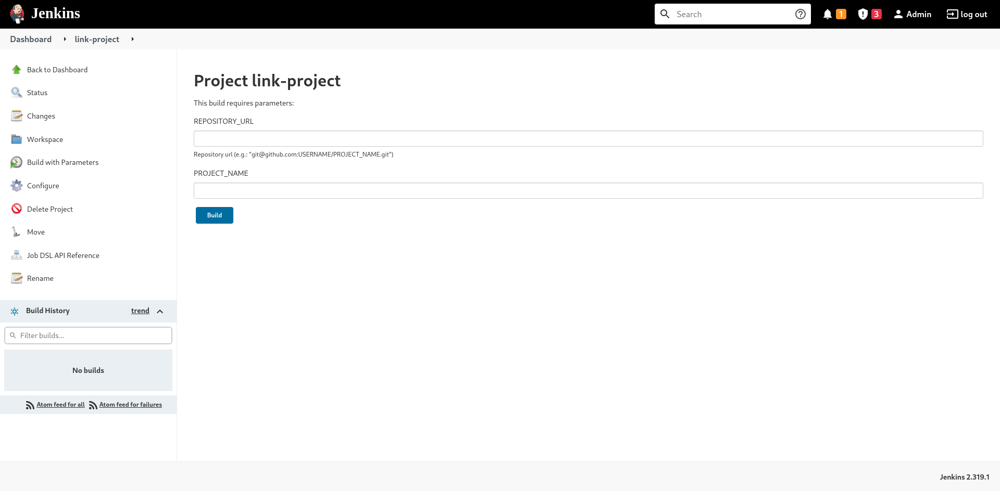

# Whanos
DevOps project : Automatically deploy (nearly) anything with a snap

## Run it

### Prerequisites
- Docker
- Docker-compose

You'll find a `docker-compose.yml` file in the repository.

**Note :** You must add a `jenkins.env` file with some environment variables

- SSH_KEY_USERNAME, it's the username of your SSH key used in your Github account
- SSH_PRIVATE_KEY, the private key linked to your Github account

Run

`docker-compose up --build`

Now, your Whanos is accessible on `localhost:8080`

_________________________

## Adding your repository to Jenkins

Using Whanos to build and dockerize your application.

### Setup the jenkins job
Go to link-project and select "Build with parameters"

You have to provide :
- `REPOSITORY_URL` : the SSH url used to clone the repository
- `PROJECT_NAME` : a **unique** name for your project in the Whanos instance.

**Note :** `PROJECT_NAME` only support lowercase ascii characters, numerics and `-` with a total lenght up to 20 max and have atleast one character in it.

Once you have clicked on build, you will find your project in the `Projects` folder.

### Checking the repository
Now, jenkins will check your repository every minute, and if you modified it, Whanos will start the CI/CD pipeline.